<!-- $theme: gaia -->

Java の基礎にして初歩に非ず
===


###### Created by Sunao Yoshii ( [謎言語使いの徒然](http://white-azalea.hatenablog.jp/) )

---
<!-- page_number: true -->

## お品書き

1. 世界に挨拶してるあたり  
  ここは全力で脱線する！
2. プリミティブと参照の違い
3. Java5 まで進んでみる
  3.1. 無名型
  3.2. ジェネリクス
4. 次回予告

---

## 世界に挨拶してるあたり

> 僕は知らない。
> たくさんのプログラミング言語を知ってるけど、ろくなコードを書けないプログラマに対する煽りで
> 
> 「一生世界に挨拶してろ」
> 
> 以上の破壊力を持った言葉を。
> 　　　　　　　　　　　　−−[Dr. メットール村井](https://twitter.com/fera_lady_z/status/948107370382499840)

---

#### 1. 世界に挨拶してるあたり(1)

みんな当然のように最初はコレを書く。

```java
// Example.java
public class Example {
  public static void main(String[] args) {
    System.out.println("Hello world.");
  }
}
```

何のことはない、オーソドックスな `Hello World` だ。  
だが、ここには様々な深読みが隠されている。

---

#### 1. 世界に挨拶してるあたり(2)

まずはここだ、ファイル名が何故クラスと一致しなければならないのかだ。

```java
// Example.java
public class Example {
```

やってみればわかるが、クラス名と一致しなければコンパイルすることはできない。  
にも関わらず、`public` でないクラスはファイル名と一致しなくてもよいのだ。

```java
// Hoge.java
class Fuga { ...
```

---

#### 1. 世界に挨拶してるあたり (3)

コレは実は C++ 言語の反省からそうしている。  
C++ 言語はこの制約がないため、書きのコードがコンパイルできる。

```cpp
// Example.cpp
public class Fire {}
public class Bomber {}
```

だが考えてみてほしい。  
**コレを保守できるのか？コードを探して直せるか？**

少なくともこんなのが続くと自信がない。

---

#### 1. 世界に挨拶してるあたり (4)

**実は `package` も似た様な仕様なのだ。**

Java でよく書く `package net.white_azalea` と書いたコードは、`net/white_azalea/` ディレクトリ配下に置かなければならない。  
そして、当然の如く、**C++ にはそんな縛りはない**。

何故そこまで縛ったのかには実は理由があるのだ。

---

#### 1. 世界に挨拶してるあたり (5)

Java の [公式仕様書](https://docs.oracle.com/javase/specs/jls/se9/html/jls-1.html) の冒頭で、直接ではないがこうした縛りをした理由が見えてくる。
気になったら読んでみると良いが要約するとこうだ。

* 多くの開発者を取り込み、かつ容易に学習できるよう、C/C++ をベースにデザインした。
* だがポインタの様な危険で、バグを生み出す仕組みは取り払う。
* 安全性、保守性の観点からいくつかの言語仕様を削除する。

というのが Java の根底にはあったのだ。

---

#### 1. 世界に挨拶してるあたり (6)

> 「あったのだ」

とした様に、今の Java には存在しない。  
何故って？取り仕切ってた James Gosling 氏は Oracle 買収劇の折退社して、今は AWS にいるのだ。

今は、JSR コミュニティが主導で開発している。  
実際には、Oracle の協力かつ超重要なパートナー組織でほとんど決めているが…。

とはいえ、そんな調子だから、Java は言語仕様レベルで危険な物を排除する意識がまだだいぶ生きてる。

---

#### 1. 世界に挨拶してるあたり (7)

さて次はどこを言及しようか…

```java
// Example.java
public class Example {
  public static void main(String[] args) {
    System.out.println("Hello world.");
  }
}
```

では、たかが main 文（これは他の言語でも正式に EntryPoint: 入り口 と言われる）が

```c
void main(String[] args) {...
```

でないのかを見ていこう。

---

#### 1. 世界に挨拶してるあたり (7)

さて、EntryPoint を下記の定義で良いのではないかという議論なのだが…

```c
void main(String[] args) {...
```

こうしたパッケージにもクラスにも所属しないメソッド、一般にグローバル関数と言う。  
実はこれも保守性に超関わるのだ。

クラスも指定しないと言うことはいつでもどこからでも呼び出すことができる事を意味する。  
仮に `main` 以外が大量に置かれたらどうなるだろう？

---

#### 1. 世界に挨拶してるあたり (8)

例えばこんな状況だ。

```java
// Collection.java
void put(int value, List to)
```

```java
// UserRegister.java
void put(int value, List to)
```

皆そうだが、用途違いで名前が衝突しまくる。

>「Collection の put を呼んだつもりが…」

C 言語がそうだったのだが、コレが酷かった…  
これも危険な仕様だから消されたのだ。

---

#### 1. 世界に挨拶してるあたり (9)

「なら `main` 以外をグローバルに置けない様にすればいいじゃん…」

そんな声が聞こえてきそうだが、コンパイラを設計する人間にとって、例外を加えるのは非常に難しいのだ。  
この辺はコンパイラを設計する話になるので、またどこかの機会に話そう。

---

#### 1. 世界に挨拶してるあたり (10)

さて、もう大分説明してきたが、まだ言語仕様に関わる部分があるぞ。

```java
System.out.println("Hello world.");
```

こいつは何故 `println("Hello world.");` だけではいかんのだろうか？
むしろ C 言語だったら `printf("Hello world.");` で良いのに、何故「System.out」なんて余計な物がつくのか？
後、import もしないで System クラスを呼べるのか？

---

#### 1. 世界に挨拶してるあたり (11)

まず片方は簡単だ。

Q. `printf("Hello world.");`でアカンのか？
A. だからグローバル関数禁止やねん！

これだけだ。
面倒なのは「何で System クラスが import 抜きで呼べるのか」だ。

---

#### 1. 世界に挨拶してるあたり (12)

「何で System クラスが import 抜きで呼べるのか」

なのだが、真っ先に立てる推論は、「Exampleクラスと同じでパッケージが無いのではないか？」疑惑だ。

だがしかし、これは否定される。

---

**java.lang 誰だお前**

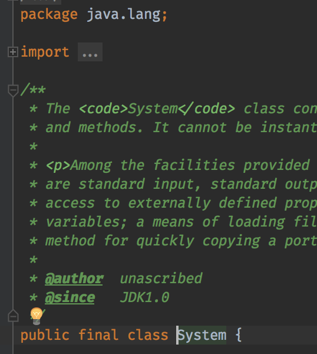

---

#### 1. 世界に挨拶してるあたり (13)

答えを言うと、`java.lang` は基礎言語仕様を保持してるクラスで、暗黙的に import されるパッケージだ。

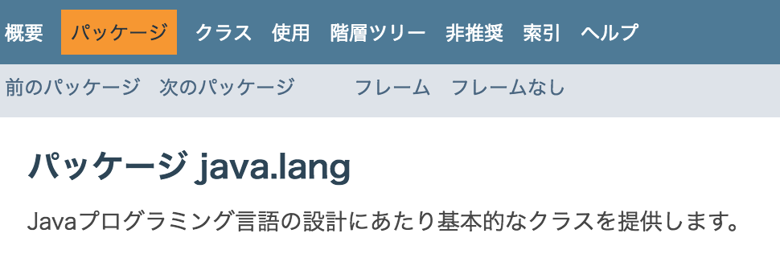

もっと言うと、JVM が勝手に読み込むので、コンパイルした class に import が埋め込まれる訳でも無い。

---

#### 1. 世界に挨拶してるあたり (14)

では、ちょっと悪用してみよう。
`java.lang` がどこからでも呼び出せるなら、そこに任意のクラスを自己定義するんだ。

そうすれば、どこからでも呼べるクラスの完成ではないか？

---

#### 1. 世界に挨拶してるあたり (15)

やってみた図
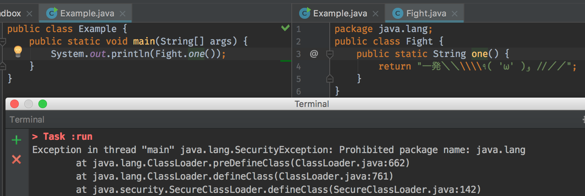

結果：コンパイルできるけど、実行時にセキュリティで弾かれる。

予想は半分当たった。

---

#### 1. 世界に挨拶してるあたり (16)

さて、ここまで Hello world を見てきた訳だが、翌々見てみるとこうした発見が色々ある。
そして、気になったところを調べるなり、聞くなりすることが勉強で、基礎力アップに繋がるんだ。

**要するに書いて試せって事。**

聞いて疑問に思うことがあってもいい。
ただし、聞いただけだと思い出せない。

**自分で試して初めて覚えていられるんだ。**

---

#### 1. 世界に挨拶してるあたり (17)

さて、四則演算程度は問題ない（というかそれが出来ないなら、プログラミング初心者本からやる方がいい）と考えて、次に行こう。
初級者がやたらとつまる変数宣言だ。

```java
int sum = 3 + 5;
```
この `=` の解釈で皆んな詰まるんだ、数学的に「等価だ」って…。
「右を左に代入する」これは素直に覚えるまで復唱しながら書いた方が早い。
コードを書いていないと忘れる事もあるだろう。

---

#### 1. 世界に挨拶してるあたり (18)

プログラム言語を覚える一番の勉強法は、結局のところアプリを作る事なんだ。

ただし、詳細設計書をコードに落とすだけだと、日本語文書で表現できる程度の言語仕様しか使わない。
高級言語の言語仕様は抽象的すぎて、日本語で厳密に表現しようとすると長大な文書となってしまう。
そんなものが納期に追われる仕様書に出る訳がない。

**自分で課題を作って、設計しなければ言語は理解できない。**
コンソールで動くオセロ位なら、１−２日あればできる先ずは書く事だ。

---

## 2. プリミティブと参照の違い

> Java って「ポインタがない」とか悪い冗談だ。
> あんなの"ポインタしかない"のに…。

---

#### 2. プリミティブと参照の違い(1)

プリミティブ型と聞いてすぐに答えられるなら、ここは無視して寝てていい。

Java には int,double,String の様に、沢山の型が存在しているが、実はその扱いは大別して二つある。
それが **プリミティブ型**と**参照型**だ。

どう違うのか？
それはメモリの持ち方が違うんだ。

いきなりメモリと言われても困るだろうが、Java を極めるには必須なんだ。

---

#### 2. プリミティブと参照の違い(2)

Java アプリケーションが動く時、JVM がざっくり３つのメモリ領域を与える(厳密にはもっとあるが…)。
Metaspace,ヒープ領域,スタック領域だ。

* Metaspace :クラスファイルデータの格納
* スタック領域:現在動いてるスレッドのスタック
* ヒープ領域:自由に使えるメモリ領域

有名な例外に、StackOverflowError, OutOfMemoryException がある。
これはスタック領域、ヒープ領域を使い切った時に発生する。

---

#### 2. プリミティブと参照の違い(3)

結構例が無いと難しいので、サンプルコードで説明する。
ここにこんなプログラムがあるとする。

```java
public class Example {
  static int id = 11; 
  public static void main(String[] args) {
    int s = id + 22;
    Value value1 = new Value(s);
  }
}
class Value {
  private int value;
  public Value(int value) {
    this.value = value;
  }
}
```

---

#### 2. プリミティブと参照の違い(4)

コンパイルすると、class ファイルが出来上がる。
今回なら以下の二つだ。

* Example.class
* Value.class

クラスファイルは、JVM のアセンブラ仕様で書かれたバイトコードなのだが、**ヒープ領域に作る予定のメモリの設計図でもある**。

---

#### 2. プリミティブと参照の違い(5)

早速動かしてみる。

`java Example` コマンドで実行すると、JVM がメモリを確保し、一番最初にメモリ内の Metaspace に、関連している Value クラスと一緒に格納される※。

まぁここまでは問題ない。

※ 細かい事を言うと、ここでJITコンパイルとか色々入るが、重要なところ以外は省く。
※ static な変数の格納場所は、Java7 以下と 8 で違う。ここでは 8 について述べる。

---

#### 2. プリミティブと参照の違い(6)

次に、`main` メソッドの含まれる `Example` クラスを読み取って、ヒープ領域にメモリが確保される。
イメージ的にはこんな感じだ。

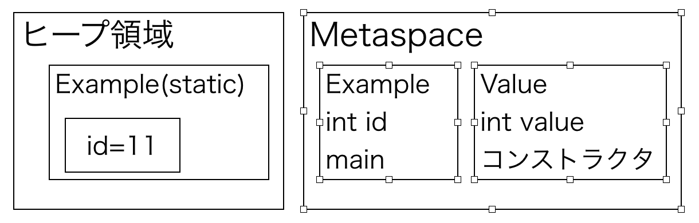
この後ようやくスタックメモリに main を読み込んで実行が始まる。

---

#### 2. プリミティブと参照の違い(7)

スタック領域に main をロードして実行を開始する。

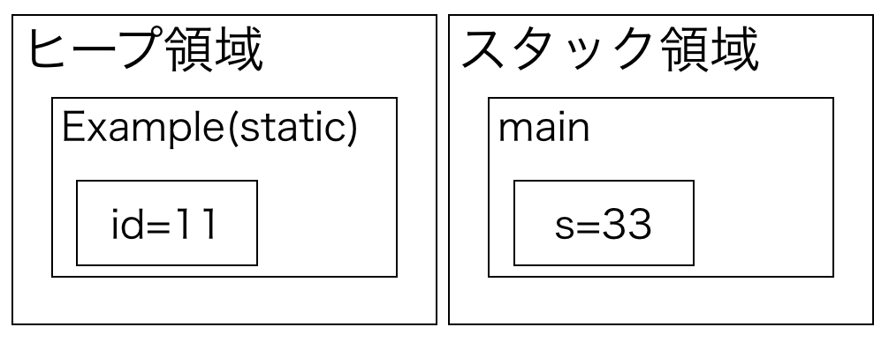
メソッド内の変数 `int s` はスタックに食わせる。
コレがプリミティブ型のメモリ配置だ。

---

#### 2. プリミティブと参照の違い(8)

`new` コマンドを実行すると、Value の値がメモリにできるが、こいつはヒープ領域にだけ作られる。

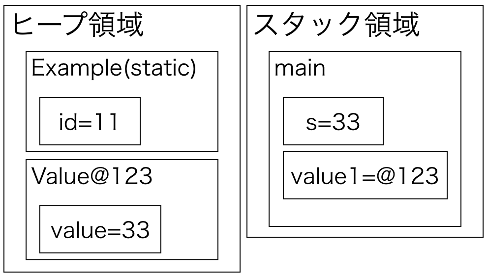

---

#### 2. プリミティブと参照の違い(9)

そして、ヒープ上のメモリアドレス(※厳密には違いますが…)が value1 変数に入る。


---

#### 2. プリミティブと参照の違い(10)

総括すると、以下のような違いがあります。

* プリミティブ型は、メモリ領域（変数）を作った箇所に直接値が入る
* new したもの（参照型）は、ヒープ領域にだけメモリを確保し、変数にはメモリアドレス(以降：参照と言います)が入る。

そうしてみると、`==` の扱いも理解出来る。

---

#### 2. プリミティブと参照の違い(11)

プリミティブ型なら、こんな風に配置される。
```java
int i = 10;
int j = 10;
```

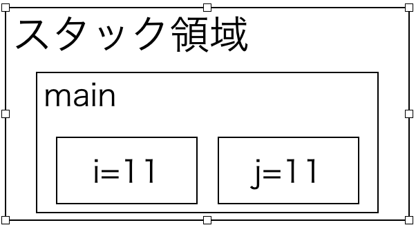

---

#### 2. プリミティブと参照の違い(12)


であれば、`i == j` と書けば、意味として `11 == 11` なので、一致する。
これはわかりやすい。

---

#### 2. プリミティブと参照の違い(13)

では参照型でやるとどうなるか？
```java
String i = "Hello";
String j = new String("Hello");
```

先ほど説明した通り、参照型はヒープ領域に値が作成され、変数にはその参照が入る。

---

#### 2. プリミティブと参照の違い(14)

メモリの配置はこんな感じだ。ここまでくればわかるだろう。

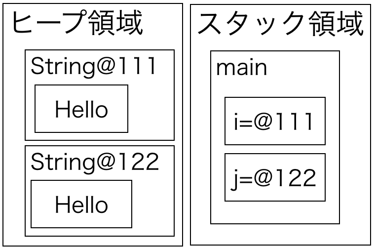

---

#### 2. プリミティブと参照の違い(15)

`i == j` は `@111 == @122` では一致しない訳だ。
だから `equals` メソッドを使えと言われる。


---

#### 2. プリミティブと参照の違い(16)

大事な事なのでもう一度言います。

* プリミティブ型は、変数に直接値が入る
* new したもの（参照型）は、ヒープ領域にだけメモリを確保し、代入した変数にメモリの参照が入る。

さらにこの仕様を見ると、メソッドの引数も理解出来る。

---

#### 2. プリミティブと参照の違い(17)

プリミティブ型はこんな感じ。
```java
public static void main(String[] arg) {
  int i = 33;
  test(i);
}
static void test(int m) {
  ...
}
```

コレをメモリにするとこんな感じだ。

---

#### 2. プリミティブと参照の違い(18)

test 呼び出し時に、変数がコピーされる。
test の中で、m を書き換えても、main に影響はありませんね？

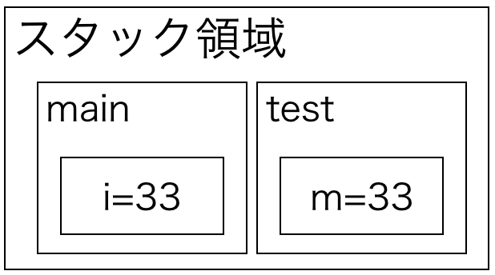

---

#### 2. プリミティブと参照の違い(19)

じゃぁ参照型はどうか？

```java
public static void main(String[] arg) {
  Value i = new Value("Hello");
  test(i);
}
static void test(Value m) {
  ...
}
```

コレをメモリにするとこんな感じだ。

---

#### 2. プリミティブと参照の違い(20)

test 呼び出し時に、変数がコピーされます。
ただしコピーされるのは参照なので、test 内で Value の中身（ヒープ領域）を書き換えると *呼び出し元に影響してしまう。*

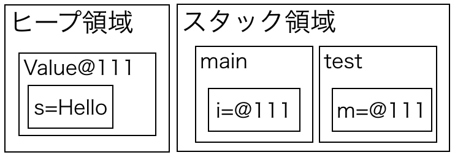

---

#### 2. プリミティブと参照の違い(21)

大事な事なので、さらにもう一度言います。

* プリミティブ型は、変数に直接値が入る
* new したもの（参照型）は、ヒープ領域にだけメモリを確保し、代入した変数にメモリの参照が入る。

---

## 3. Java5 に進んでみる

> 2004 年、Java7 まで脈々と受け継がれた Java。
> ジェネリクス、匿名クラス、オートボクシング/アンボクシング、enum、拡張for、アノテーションの追加、可変長引数、static import
> 君は何個使えるかな？
> 

---

#### 3. Java5 に進んでみる

そう、大量に言語仕様が追加された Java5 (これまでは Java 1.x の表記だったのに 1.5 でいきなり Java5 を名乗りました)。

この時に入った言語仕様はあまりにも多いので、今回は匿名クラスとジェネリクスだけ触れる。

---

#### 3.1. 匿名クラス

Java の言語仕様上は Anonymous Class と書かれてます。
コレはインターフェースの実装を名前抜きで行うというものでした。

*名前抜きとはどういうことか？*

次にちょっとした例を挙げます。

---

#### 3.1. 匿名クラス

Java1.4 時代のソート処理のコードです。

```java
class IntComparator implements Comparator {
    public int compare(Object o1, Object o2) {
        return (Integer) o1 - (Integer) o2;
    }
}
// 中略
    List values = Arrays.asList(4,3,5,7,1,3);
    values.sort(new IntComparator());
```

昔はこんな書き方してたのですね。
ただしこの場合、ソートのパターンに合わせて毎回クラスを書かなければいけませんでした。

---

#### 3.1. 匿名クラス

コレが匿名クラスの出現で一変します。

```java
  List<Integer> values = Arrays.asList(4,3,5,7,1,3);
  values.sort(new Comparator() {
    public int compare(Object o1, Object o2) {
      return (Integer) o1 - (Integer) o2;
    }
  });
```
使い捨てのクラスを宣言しなくてよくなりました。
見ての通り、`Comparator` には前の例であったような`IntComparator`のような名前がありません。

コレが匿名クラスです。

---

#### 3.1. 匿名クラス

実はこの匿名クラス、Java5 当時はコンパイルすると

```sh
Example.class
Example$Comparator-1.class
```
なんて謎のクラスが生まれてたのですね。
（Java8 現在ではそんなことはありません）

---

#### 3.2 ジェネリクス

> 「これを全部処理してくれ」そう言って渡されたコンテナを見て、思考が止まってしまった。
> 
> 「なんかガサゴソ言ってるんだが…せめて何が入ってるのか言えよ、怖くて何もできねーよ」
> 

---

#### 3.2 ジェネリクス

ジェネリクスは型の制約の一つだ。
主にコンテナを扱う時に汎用性を持たせることができる。

コレも例を見ていこう。

---

#### 3.2 ジェネリクス（基礎編）

Java1.4 以前であれば、List 型は中に`Object`としてしか入れれなかった。

```java
List values = Arrays.asList(2,3,5,7,9);
Integer result = (Integer) values.get(0);
```
何が悪いか？
* Object が入ると言うことは、Integer+String とか何でも入ってしまうので安全ではない。
* 取り出すときに何が入っているのかの保証がない。
* 取り出しにキャストが要る。

---

#### 3.2 ジェネリクス（基礎編）

そこで型パラメータとして中に入れるものを指定する。

```java
List<Integer> values = Arrays.asList(2,3,5,7,9);
Integer result = values.get(0);
```

コレが基礎だ。

---

#### 3.2 ジェネリクス（基礎編）

中の型を指定するから中に違うものが入らなくなります。

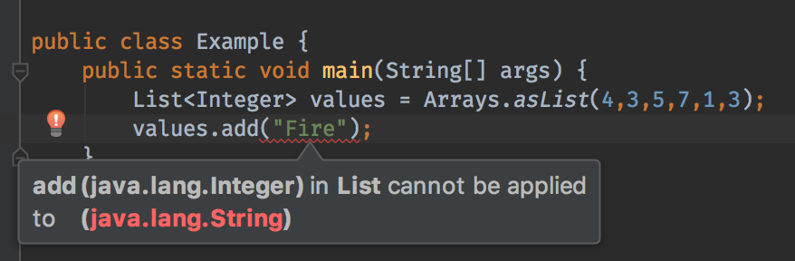

---

#### 3.2 ジェネリクス（応用編）

**ではこのジェネリクス、どうやって実現してる？**
そう、そこに知識の源泉がある。

と言うことで、下記のコードをコンパイルして class ファイルを逆コンパイルして見ます。

```java
    List<Integer> values = new ArrayList<>();
    values.add(64);
    Integer num = values.get(0);
```

---

#### 3.2 ジェネリクス（応用編）

でコンパイルと逆コンパイルをしてみました。

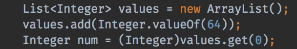

Java5 時代からは随分変わっていますが、put 時と get 時に自動キャストが入るように実装されます。
逆にこの実装であればそれを壊すことも出来ます。

---

#### 3.2 ジェネリクス（応用編）

だからこんなことも出来る。
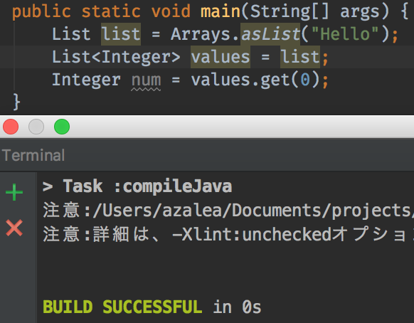
**いいかやるなよ？絶対やるなよ？**

---

#### 3.2 ジェネリクス（応用編）

こいつは実はかなりの応用が出来る。
むしろコレを知らずに設計するとか個人的に正気を疑うレベルだ。
例として以下のような構造を考える。

* class User
* class TestUser extends User

この時
* List&lt;User&gt; を与えたら Map&lt;UserId, User&gt; に変換し、TestUser なら Map&lt;UserId, TestUser&gt; を返す処理を記述する。

---

#### 3.2 ジェネリクス（応用編）

二つのクラスをこのように定義する。

```java
class User {
    public final int id;
    public final String name;
    public User(int id, String name) {
        this.id = id;
        this.name = name;
    }
}
class TestUser extends User {
    public final String email;
    public TestUser(int id, String name, String email) {
        super(id, name);
        this.email = email;
    }
}
```

---

#### 3.2 ジェネリクス（応用編）

ここで命題。

> List&lt;User&gt; を与えたら Map&lt;UserId, User&gt; に変換し、TestUser なら Map&lt;UserId, TestUser&gt; を返す処理を記述する。

どうすればいいでしょう？
User だけならこう書けばいい。

```java
    Map<Integer, User> conv(List<User> dataSource) {
        Map<Integer, User> data = new HashMap<>();
        for (User user : dataSource) { data.put(user.id, user); }
        return data;
    }
```

---


#### 3.2 ジェネリクス（応用編）

Generics を正しく使えばこんな書き方も出来る。

```java
    <T extends User> Map<Integer, T> conv(
            List<T> dataSource) {
        Map<Integer, T> data = new HashMap<>();
        for (T user : dataSource) {
            data.put(user.id, user);
        }
        return data;
    }
```

`<T>` が型パラメータ宣言で、`<T extends User>` は制約条件で、「T は User を継承ものだけ許可」としています。
だから、User で定義した id がアクセスできる。

---

#### 3.2 ジェネリクス（応用編）

そしてこんな風に扱うことが出来るのだ。

```java
    List<TestUser> userList = Arrays.asList(
        new TestUser(1, "azalea", "azalea@example.net"),
        new TestUser(2, "armeria", "armeria@example.com")
    );
    Map<Integer, TestUser> map = convert(userList);
```
今回は結構単純だが、応答を `Map<Integer, List<T>>` みたいにして、データのグルーピングをするとかに応用出来る。

---

## 次回予告

---

Java 5 の仕様を少しづつやり始めた一行。

しかしJava5 は脱落者が多数現れる仕様の巣窟だった。

**次回：Java の基礎にして初歩に非ず**
* 拡張 for は基本だよね
* アノテーションなしとか正気を疑うぞ
* 並列処理が Thread クラスだけだと思ったら大間違いだぞ
* 可変長引数！
* `static import` のご利用は計画的に
