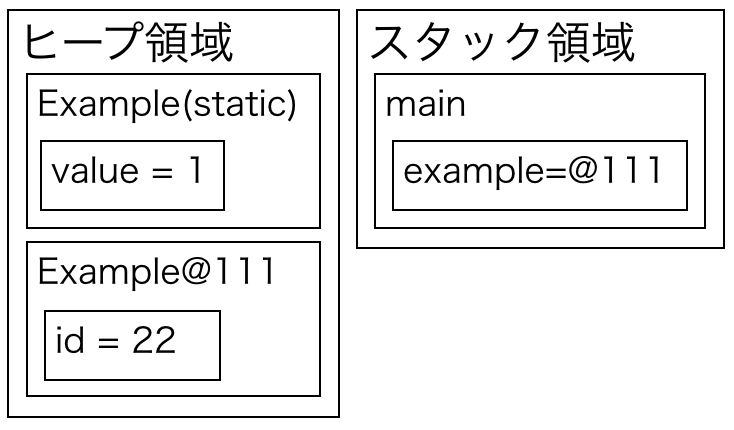
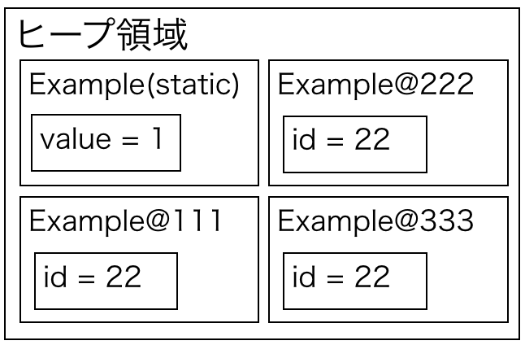

<!-- $theme: gaia -->

Java の基礎にして初歩に非ず
===


###### Created by Sunao Yoshii ( [技術をかじる猫](http://white-azalea.hatenablog.jp/) )

---
<!-- page_number: true -->

## お品書き

1. 世界に挨拶してるあたり  
2. プリミティブと参照の違い
3. static を熱く語ろう
4. 次回予告

---

## 世界に挨拶してるあたり

> 僕は知らない。
> たくさんのプログラミング言語を知ってるけど、ろくなコードを書けないプログラマに対する煽りで
> 
> 「一生世界に挨拶してろ」
> 
> 以上の破壊力を持った言葉を。
> 　　　　　　　　　　　　−−[Dr. メットール村井](https://twitter.com/fera_lady_z/status/948107370382499840)

---

#### 1. 世界に挨拶してるあたり(1)

みんな当然のように最初はコレを書く。

```java
// Example.java
public class Example {
  public static void main(String[] args) {
    System.out.println("Hello world.");
  }
}
```

何のことはない、オーソドックスな `Hello World` だ。  
だが、ここには様々な深読みが隠されている。

---

#### 1. 世界に挨拶してるあたり(2)

まずはここだ、ファイル名が何故クラスと一致しなければならないのかだ。

```java
// Example.java
public class Example {
```

やってみればわかるが、クラス名と一致しなければコンパイルすることはできない。  
にも関わらず、`public` でないクラスはファイル名と一致しなくてもよいのだ。

```java
// Hoge.java
class Fuga { ...
```

---

#### 1. 世界に挨拶してるあたり (3)

コレは実は C++ 言語の反省からそうしている。  
C++ 言語はこの制約がないため、書きのコードがコンパイルできる。

```cpp
// Example.cpp
public class Fire {}
public class Bomber {}
```

だが考えてみてほしい。  
**コレを保守できるのか？コードを探して直せるか？**

少なくともこんなのが続くと自信がない。

---

#### 1. 世界に挨拶してるあたり (4)

**実は `package` も似た様な仕様なのだ。**

Java でよく書く `package net.white_azalea` と書いたコードは、`net/white_azalea/` ディレクトリ配下に置かなければならない。  
そして、当然の如く、**C++ にはそんな縛りはない**。

何故そこまで縛ったのかには実は理由があるのだ。

---

#### 1. 世界に挨拶してるあたり (5)

Java の [公式仕様書](https://docs.oracle.com/javase/specs/jls/se9/html/jls-1.html) の冒頭で、直接ではないがこうした縛りをした理由が見えてくる。
気になったら読んでみると良いが要約するとこうだ。

* 多くの開発者を取り込み、かつ容易に学習できるよう、C/C++ をベースにデザインした。
* だがポインタの様な危険で、バグを生み出す仕組みは取り払う。
* 安全性、保守性の観点からいくつかの言語仕様を削除する。

というのが Java の根底にはあったのだ。

---

#### 1. 世界に挨拶してるあたり (6)

> 「あったのだ」

とした様に、今の Java には存在しない。  
何故って？取り仕切ってた James Gosling 氏は Oracle 買収劇の折退社して、今は AWS にいるのだ。

今は、JSR コミュニティが主導で開発している。  
実際には、Oracle の協力かつ超重要なパートナー組織でほとんど決めているが…。

とはいえ、そんな調子だから、Java は言語仕様レベルで危険な物を排除する意識がまだだいぶ生きてる。

---

#### 1. 世界に挨拶してるあたり (7)

さて次はどこを言及しようか…

```java
// Example.java
public class Example {
  public static void main(String[] args) {
    System.out.println("Hello world.");
  }
}
```

では、たかが main 文（これは他の言語でも正式に EntryPoint: 入り口 と言われる）が

```c
void main(String[] args) {...
```

でないのかを見ていこう。

---

#### 1. 世界に挨拶してるあたり (7)

さて、EntryPoint を下記の定義で良いのではないかという議論なのだが…

```c
void main(String[] args) {...
```

こうしたパッケージにもクラスにも所属しないメソッド、一般にグローバル関数と言う。  
実はこれも保守性に超関わるのだ。

クラスも指定しないと言うことはいつでもどこからでも呼び出すことができる事を意味する。  
仮に `main` 以外が大量に置かれたらどうなるだろう？

---

#### 1. 世界に挨拶してるあたり (8)

例えばこんな状況だ。

```java
// Collection.java
void put(int value, List to)
```

```java
// UserRegister.java
void put(int value, List to)
```

皆そうだが、用途違いで名前が衝突しまくる。

>「Collection の put を呼んだつもりが…」

C 言語がそうだったのだが、コレが酷かった…  
これも危険な仕様だから消されたのだ。

---

#### 1. 世界に挨拶してるあたり (9)

「なら `main` 以外をグローバルに置けない様にすればいいじゃん…」

そんな声が聞こえてきそうだが、コンパイラを設計する人間にとって、例外を加えるのは非常に難しいのだ。  
この辺はコンパイラを設計する話になるので、またどこかの機会に話そう。

---

#### 1. 世界に挨拶してるあたり (10)

さて、もう大分説明してきたが、まだ言語仕様に関わる部分があるぞ。

```java
System.out.println("Hello world.");
```

こいつは何故 `println("Hello world.");` だけではいかんのだろうか？
むしろ C 言語だったら `printf("Hello world.");` で良いのに、何故「System.out」なんて余計な物がつくのか？
後、import もしないで System クラスを呼べるのか？

---

#### 1. 世界に挨拶してるあたり (11)

まず片方は簡単だ。

Q. `printf("Hello world.");`でアカンのか？
A. だからグローバル関数禁止やねん！

これだけだ。
面倒なのは「何で System クラスが import 抜きで呼べるのか」だ。

---

#### 1. 世界に挨拶してるあたり (12)

「何で System クラスが import 抜きで呼べるのか」

なのだが、真っ先に立てる推論は、「Exampleクラスと同じでパッケージが無いのではないか？」疑惑だ。

だがしかし、これは否定される。

---

**java.lang 誰だお前**


---

#### 1. 世界に挨拶してるあたり (13)

答えを言うと、`java.lang` は基礎言語仕様を保持してるクラスで、暗黙的に import されるパッケージだ。


もっと言うと、JVM が勝手に読み込むので、コンパイルした class に import が埋め込まれる訳でも無い。

---

#### 1. 世界に挨拶してるあたり (14)

では、ちょっと悪用してみよう。
`java.lang` がどこからでも呼び出せるなら、そこに任意のクラスを自己定義するんだ。

そうすれば、どこからでも呼べるクラスの完成ではないか？

---

#### 1. 世界に挨拶してるあたり (15)

やってみた図


結果：コンパイルできるけど、実行時にセキュリティで弾かれる。

予想は半分当たった。

---

#### 1. 世界に挨拶してるあたり (16)

さて、ここまで Hello world を見てきた訳だが、翌々見てみるとこうした発見が色々ある。
そして、気になったところを調べるなり、聞くなりすることが勉強で、基礎力アップに繋がるんだ。

**要するに書いて試せって事。**

聞いて疑問に思うことがあってもいい。
ただし、聞いただけだと思い出せない。

**自分で試して初めて覚えていられるんだ。**

---

#### 1. 世界に挨拶してるあたり (17)

さて、四則演算程度は問題ない（というかそれが出来ないなら、プログラミング初心者本からやる方がいい）と考えて、次に行こう。
初級者がやたらとつまる変数宣言だ。

```java
int sum = 3 + 5;
```
この `=` の解釈で皆んな詰まるんだ、数学的に「等価だ」って…。
「右を左に代入する」これは素直に覚えるまで復唱しながら書いた方が早い。
コードを書いていないと忘れる事もあるだろう。

---

#### 1. 世界に挨拶してるあたり (18)

プログラム言語を覚える一番の勉強法は、結局のところアプリを作る事なんだ。

ただし、詳細設計書をコードに落とすだけだと、日本語文書で表現できる程度の言語仕様しか使わない。
高級言語の言語仕様は抽象的すぎて、日本語で厳密に表現しようとすると長大な文書となってしまう。
そんなものが納期に追われる仕様書に出る訳がない。

**自分で課題を作って、設計しなければ言語は理解できない。**
コンソールで動くオセロ位なら、１−２日あればできる先ずは書く事だ。

---

## 2. プリミティブと参照の違い

###### Java って「ポインタがない」とか悪い冗談だ。あんなの"ポインタしかない"のに…。

---

#### 2. プリミティブと参照の違い(1)

プリミティブ型と聞いてすぐに答えられるなら、ここは無視して寝てていい。

Java には int,double,String の様に、沢山の型が存在しているが、実はその扱いは大別して二つある。
それが **プリミティブ型**と**参照型**だ。

どう違うのか？
それはメモリの持ち方が違うんだ。

いきなりメモリと言われても困るだろうが、Java を極めるには必須なんだ。

---

#### 2. プリミティブと参照の違い(2)

Java アプリケーションが動く時、メモリを確保する。この話題に関係するのは Metaspace,ヒープ領域,スタック領域だ。[他の領域はここが分かりやすい(ぺーぺーSEのブログ)](http://blog.pepese.com/entry/2016/10/10/144816)

* Metaspace :クラスファイルデータの格納
* スタック領域:現在動いてるスレッドのスタック
* ヒープ領域:オブジェクトを格納するメモリ空間

有名な例外に、StackOverflowError, OutOfMemoryException がある。
これはスタック領域、ヒープ領域を使い切った時に発生する。

---

#### 2. プリミティブと参照の違い(3)

例が無いと難しいので、サンプルコードで説明する。
ここにこんなプログラムがあるとする。

```java
public class Example {
  static int id = 11; 
  public static void main(String[] args) {
    int s = id + 22;
    Value value1 = new Value(s);
  }
}
class Value {
  private int value;
  public Value(int value) {
    this.value = value;
  }
}
```

---

#### 2. プリミティブと参照の違い(4)

コンパイルすると、class ファイルが出来上がる。
今回なら以下の二つだ。

* Example.class
* Value.class

クラスファイルは、JVM のアセンブラ仕様で書かれたバイトコードなのだが、**ヒープ領域に作る予定のメモリの設計図でもある**。

---

#### 2. プリミティブと参照の違い(5)

早速動かしてみる。

`java Example` コマンドで実行すると、JVM がメモリを確保し、一番最初にメモリ内の Metaspace に、関連している Value クラスと一緒に格納される※。

まぁここまでは問題ない。

※ 細かい事を言うと、ここでJITコンパイルとか色々入るが、重要なところ以外は省く。
※ static な変数の格納場所は、Java7 以下と 8 で違う。ここでは 8 について述べる。

---

#### 2. プリミティブと参照の違い(6)

次に、`main` メソッドの含まれる `Example` クラスを読み取って、ヒープ領域にメモリが確保される。
イメージ的にはこんな感じだ。


この後ようやくスタックメモリに main を読み込んで実行が始まる。

---

#### 2. プリミティブと参照の違い(7)

スタック領域に main をロードして実行を開始する。


メソッド内の変数 `int s` はスタックに食わせる。
コレがプリミティブ型のメモリ配置だ。

---

#### 2. プリミティブと参照の違い(8)

`new` コマンドを実行すると、Value の値がメモリにできるが、こいつはヒープ領域にだけ作られる。


---

#### 2. プリミティブと参照の違い(9)

そして、ヒープ上のメモリアドレス(※厳密には違いますが…)が value1 変数に入る。


---

#### 2. プリミティブと参照の違い(10)

総括すると、以下のような違いがある。

* プリミティブ型は、メモリ領域（変数）を作った箇所に直接値が入る
* new したもの（参照型）は、ヒープ領域にだけメモリを確保し、変数にはメモリアドレスっぽいもの(以降：参照と言います)が入る。

この参照（メモリアドレス）、C++ 使いならわかるだろう。**ポインタ**の事だ。

そうしてみると、`==` の扱いも理解出来る。

---

#### 2. プリミティブと参照の違い(11)

プリミティブ型なら、こんな風に配置される。
```java
int i = 10;
int j = 10;
```


---

#### 2. プリミティブと参照の違い(12)


であれば、`i == j` と書けば、意味として `11 == 11` なので、一致する。
これはわかりやすい。

---

#### 2. プリミティブと参照の違い(13)

では参照型でやるとどうなるか？
```java
String i = "Hello";
String j = new String("Hello");
```

先ほど説明した通り、参照型はヒープ領域に値が作成され、変数にはその参照が入る。

---

#### 2. プリミティブと参照の違い(14)

メモリの配置はこんな感じだ。ここまでくればわかるだろう。


---

#### 2. プリミティブと参照の違い(15)

`i == j` は `@111 == @122` では一致しない訳だ。
だから `equals` メソッドを使えと言われる。


---

#### 2. プリミティブと参照の違い(16)

大事な事なのでもう一度言う。

* プリミティブ型は、変数に直接値が入る
* new したもの（参照型）は、ヒープ領域にだけメモリを確保し、代入した変数にメモリの参照が入る。

さらにこの仕様を見ると、メソッドの引数も理解出来る。

---

#### 2. プリミティブと参照の違い(17)

プリミティブ型はこんな感じ。
```java
public static void main(String[] arg) {
  int i = 33;
  test(i);
}
static void test(int m) {
  ...
}
```

コレをメモリにするとこんな感じだ。

---

#### 2. プリミティブと参照の違い(18)

test 呼び出し時に、変数がコピーされる。
なので、test の中で、m を書き換えても、main に影響はない。


---

#### 2. プリミティブと参照の違い(19)

じゃぁ参照型はどうか？

```java
public static void main(String[] arg) {
  Value i = new Value("Hello");
  test(i);
}
static void test(Value m) {
  ...
}
```

コレをメモリにするとこんな感じだ。

---

#### 2. プリミティブと参照の違い(20)

test 呼び出し時に、変数、**参照** がコピーされる。
必然的にtest 内で Value の中身（参照の先）を書き換えると *呼び出し元に影響してしまう。*


---

#### 2. プリミティブと参照の違い(21)

大事な事なので、さらにもう一度言います。

* プリミティブ型は、変数に直接値が入る
* new したもの（参照型）は、ヒープ領域にだけメモリを確保し、代入した変数にメモリの参照が入る。

だから言ったのだ **ポインタしかない** と。

---

## 3. static を熱く語ろう
#### ~static(静的)にvariable(変わる)愚~

---

#### 3. static を熱く語ろう

メモリの話をしたら、次はstaticとinstanceの話だ。

この使い分けが良くわからずにいると [こんな悲惨な記事](http://el.jibun.atmarkit.co.jp/minagawa/2010/04/post-ebc4.html) を書くようになってしまう。
実際、この記事は様々な各所でフルボッコにされている。

だが、static とインスタンスの違いを説明する文書は意外と少ない。
むしろ使い方の違いだけを理解しているものが多い。

そこでここでは何が違うのかを **メモリレベル** で話そう。

---

#### 3. static を熱く語ろう

先ずは [公式言語仕様](https://docs.oracle.com/javase/specs/jls/se9/html/index.html)を読んでみる。
> If a field is declared static, there exists exactly one incarnation of the field, no matter how many instances (possibly zero) of the class may eventually be created.([章 8.3.1.1](https://docs.oracle.com/javase/specs/jls/se9/html/jls-8.html#jls-8.3.1.1))
> フィールドに static 定義すると、たとえどれだけのインスタンスを作成しようとたった一つのみの実態を持ちます。

つまりインスタンスとは別にひとつだけメモリを持つわけです。

---

#### 3. static を熱く語ろう

もっと具体的に行きましょうか。

```java
class Example {
  public static int value = 1;
  public int id = 22;
}
```

これをコンパイルしたとしましょう。
main の中はコレです。

```java
Example example = new Example();
```

因みに言語使用上、static の初期化は、クラス定義を呼んだ時なので、new も該当します。

---

#### 3. static を熱く語ろう

すると、メモリマップ上では下記のような構成になる。static と書かれてるのが static データ、もうひとつがインスタンスだ。



---

#### 3. static を熱く語ろう

この static な領域は、何個 new しても変わらない。



---

#### 3. static を熱く語ろう

例えばこんなコード(Java8 の非同期処理)を書いて、スレッドから`static`フィールドを叩く。

```java
class ExampleRunner implements Callable<Integer> {
  String name;
  public ExampleRunner(String name) { this.name = name; }
  public Integer call() throws Exception {
    for (int i=0; i<10; i++) {
      Example.value++;
      System.out.println(this.name + ":" + Example.value);
    }
    return Example.value;
  }
}
```

---

#### 3. static を熱く語ろう

実行してみる。
```java
ExecutorService service = Executors.newFixedThreadPool(3);
List<Callable<Integer>> callables = new ArrayList<>();
callables.add(new ExampleRunner("Thread1"));
callables.add(new ExampleRunner("Thread2"));
callables.add(new ExampleRunner("Thread3"));
service.invokeAll(callables)
  .stream()
  .forEach(future -> {
    try {
      System.out.println("Finished at: " + future.get());
    } catch (InterruptedException | ExecutionException e) {
      e.printStackTrace();
    }
});
```

---

#### 3. static を熱く語ろう

当然ながら揃うわけがない。
運良く最後は 30 になったが、下手したらそれすら保証されない。
```
> Task :run
Thread1:3
Thread1:4
Thread3:3
Thread2:3
Thread3:6
; 中略
Thread2:28
Thread2:30
Finished at: 29
Finished at: 30
Finished at: 24
```

---

#### 3. static を熱く語ろう

特に web アプリは、ユーザの
**1リクエスト=1スレッド**で動くから、物によっては数十スレッドが同時に動く。

そこで仮に `static` 変数を使ったとして、その値を保証できるだろうか？
仮にできてもそんな職人芸誰が保守できるんだ…。

**再現性のないバグとか大体コイツのせいだったりする。**

---

#### 3. static を熱く語ろう

だが勘違いしてはならない、`static` を使うなと言ってるんじゃない。
**static 変数は書き換えなければいいんだ。**

`final`で定数にする、`static` コンストラクタ以外で変数設定しない…やり方は結構ある。

そもそも論、*[EffectiveJava](http://amzn.to/2DzHjPz)* に始まり、様々な本で
**「スレッド外の値を書き換えるんじゃ無い」** と言ってる。
要するに *アンチパターン※* なんだ。

※避けるべきやり方、実装の事。

---

## 次回予告

---

**次回：Java の基礎にして初歩に非ず**

* クラスパス
* Java5 に立ち返って、言語仕様を見ていく
* （時間があったら）型推論