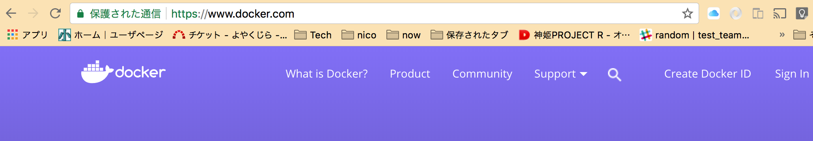
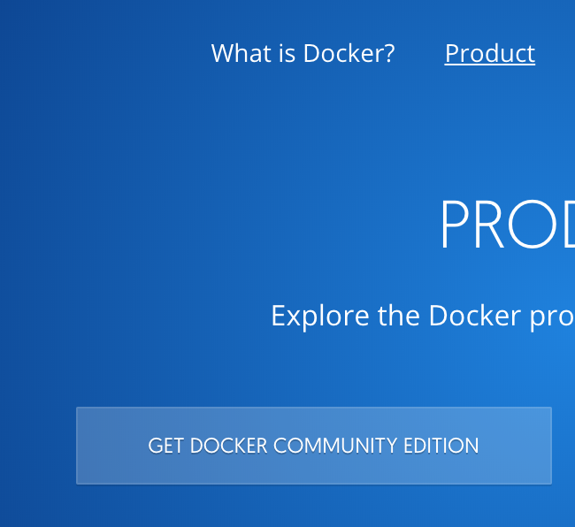
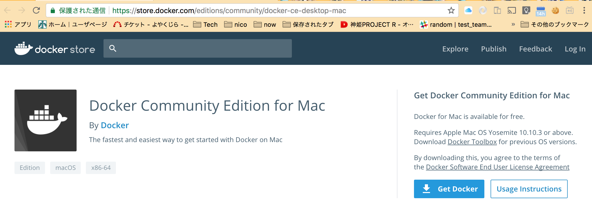
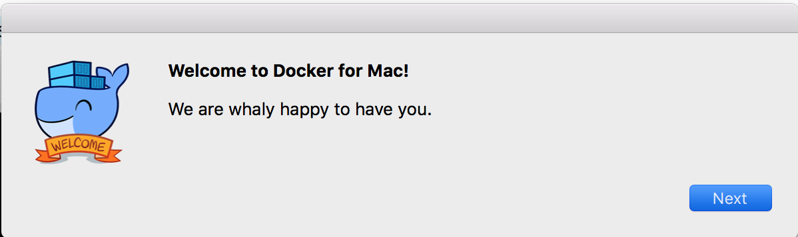
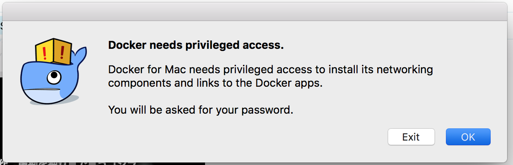
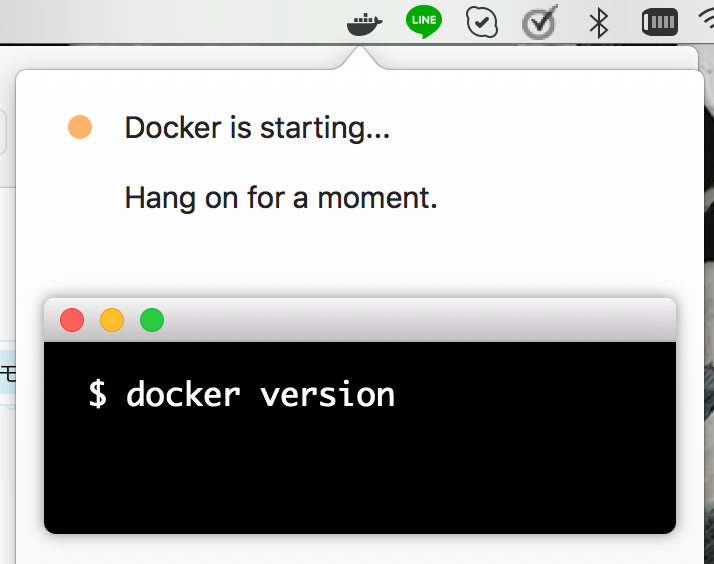
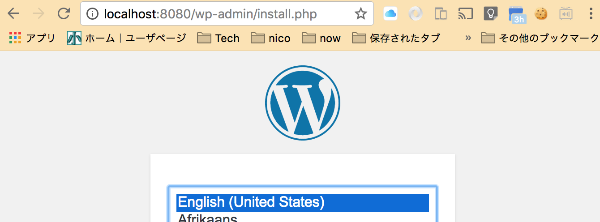
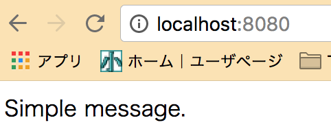
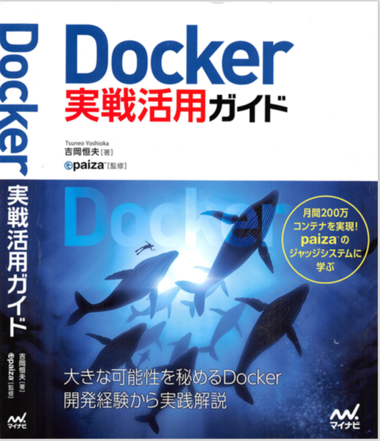

<!-- $theme: gaia -->

Hello Docker
===

#### Docker を新規入門してみた。

---
<!-- page_number: true -->

# Install on Mac

---

## Install to Mac

まずは Mac にインストールするところから。
と言っても難しい事はなくて、公式サイトを開いて、CommunityDownload 版を落として実行するだけ。



---

#### Install to Mac



---

#### Install to Mac

ダウンロードサイトから落とす。



---

#### Install to Mac

初回起動するとインストールが継続します。



---

#### Install to Mac

権限要るんですね、そりゃそうですよね



---

#### Install to Mac

こんなのが見えれば完了。



---

# 最初の一歩

---

#### 最初の一歩

って言っても Hello world でございます。
bash 開いて、`docker run hello-world` 叩いて見ます。

```sh
$ docker run hello-world
Unable to find image 'hello-world:latest' locally
latest: Pulling from library/hello-world
ca4f61b1923c: Pull complete 
Digest: sha256:083de497cff944f969d8499ab94f07134c50bcf5e6b9559b27182d3fa80ce3f7
Status: Downloaded newer image for hello-world:latest

Hello from Docker!
  #中略
```

`run` は同名のコンテナを [Dockerhub](https://hub.docker.com/) というサイトから落として来て実行するコマンドです。

---

#### 最初の一歩

シェルで `docker` がどんな状況になったのかを確認して見ます。

```sh
$ docker image ls
REPOSITORY          TAG                 IMAGE ID            CREATED             SIZE
hello-world         latest              f2a91732366c        2 months ago        1.85kB
```

イメージがダウンロードされ

```sh
$ docker container ls -a
CONTAINER ID        IMAGE               COMMAND             CREATED             STATUS                   PORTS               NAMES
32e6c626a61e        hello-world         "/hello"            8 hours ago         Exited (0) 8 hours ago                       affectionate_hodgkin
```

それをベースにしてコンテナが作成されています。

---

#### 最初の一歩

イメージとコンテナの関係は

* image  
  コンテナ（実行単位）を作る元となるデータ。
  状態も変更も受け付けない DVD-R に焼いたOSの様なもの。
* container
  image を元に作り出した実行単位。
  image の内容にもよるが、状態を持つ。
  インストール済みの環境のようなもの。

そして image も container も気軽に作成/破棄できることから、色々作るには便利な感じです。

---

#### 最初の一歩

試しに、`ubuntu` イメージを起動してみます。  
イメージがないので当然ダウンロードから始まります。

```sh
$ docker run -it --name example-ubuntu ubuntu /bin/bash
Unable to find image 'ubuntu:latest' locally
latest: Pulling from library/ubuntu
1be7f2b886e8: Pull complete 
  # 中略
root@c90e945cbe38:/# cat /etc/lsb-release 
DISTRIB_ID=Ubuntu
DISTRIB_RELEASE=16.04
DISTRIB_CODENAME=xenial
DISTRIB_DESCRIPTION="Ubuntu 16.04.3 LTS"
```

`ubuntu` が正常起動してる事が見て取れます。

---

#### 最初の一歩

`docker run -it --name example-ubuntu ubuntu /bin/bash` の意味は。

* `run` : イメージを実行します。
* `-it` : `i` で操作モードとして起動、`t` は tty 接続を意味します。
* `--name example-ubuntu` : 実行時のコンテナ名を指定します。
* `ubuntu` : 実行したいイメージ名です。
* `/bin/bash` : イメージ上で実行するコマンドです。

---

#### 最初の一歩

補足：使い方に迷ったら `help` で見れますので、何かあれば参照できます。

```sh
$ docker run --help

Usage:	docker run [OPTIONS] IMAGE [COMMAND] [ARG...]

Run a command in a new container

Options:
  --add-host list   Add a custom host-to-IP mapping (host:ip)
```

---

#### 最初の一歩

今の状況を確認しましょう。
イメージがダウンロードされており

```sh
$ docker image ls
REPOSITORY          TAG                 IMAGE ID            CREATED             SIZE
ubuntu              latest              0458a4468cbc        3 weeks ago         112MB
hello-world         latest              f2a91732366c        2 months ago        1.85kB
```

`example-ubuntu` という名前でコンテナが作成されます

```sh
$ docker container ls -a
CONTAINER ID        IMAGE               COMMAND             CREATED             STATUS                     PORTS               NAMES
c90e945cbe38        ubuntu              "/bin/bash"         13 minutes ago      Exited (0) 4 minutes ago                       example-ubuntu
32e6c626a61e        hello-world         "/hello"            9 hours ago         Exited (0) 9 hours ago                         affectionate_hodgkin
```

---

#### 最初の一歩

`Ctrl + D` でログアウトして、docker のプロセスを覗いてみます。

```sh
$ docker ps
CONTAINER ID        IMAGE               COMMAND             CREATED             STATUS              PORTS               NAMES
```

起動中プロセスとしては消えている事がわかります。
しかし、`-a` オプションでコンテナを見ると、コンテナが削除された訳ではない事がわかります。

```sh
$ docker container ls -a
CONTAINER ID        IMAGE               COMMAND             CREATED             STATUS                    PORTS               NAMES
c90e945cbe38        ubuntu              "/bin/bash"         2 hours ago         Exited (0) 2 hours ago                        example-ubuntu
32e6c626a61e        hello-world         "/hello"            10 hours ago        Exited (0) 10 hours ago                       affectionate_hodgkin
```

---

#### 最初の一歩

では眠ったコンテナを再度起こしてみましょう。

```sh
$ docker start -i example-ubuntu
root@c90e945cbe38:/# 
```

問題なく起動します。

---

# アプリを起動してみる

---

#### アプリを起動してみる

今回起動するのは `mysql` と `wordpress` の二本です。
まずは MySQL からいきましょう。

[dockerhub](https://hub.docker.com/_/mysql/) を見て見ると、より詳しい情報がありますが、今回は単純に root 起動するだけとしましょうか。

---

#### アプリを起動してみる

起動して見た図。
`docker run -d -e MYSQL_ROOT_PASSWORD=password --name db mysql` で起動します。

```sh
$ docker run -d -e MYSQL_ROOT_PASSWORD=password --name db mysql
Unable to find image 'mysql:latest' locally
latest: Pulling from library/mysql
4176fe04cefe: Pull complete 
  # 中略
Status: Downloaded newer image for mysql:latest
fabd884fc62cd1ff2df787b652f28bf9525f790c5c50cff56fc01511ab4f7016
$ docker ps
CONTAINER ID        IMAGE               COMMAND                  CREATED             STATUS              PORTS               NAMES
fabd884fc62c        mysql               "docker-entrypoint.s…"   5 seconds ago       Up 2 seconds        3306/tcp            db
```

---

#### アプリを起動してみる

次に [wordpress](https://hub.docker.com/_/wordpress/) です。

`docker run --link db:mysql -p 8080:80 -e WORDPRESS_DB_PASSWORD=password --name web wordpress`

コマンドは長いですが… mysql とリンクさせます。
また、ローカルの 8080 ポートを、コンテナの 80 ポートに転送。

```sh
$ docker run --link db:mysql -p 8080:80 -e WORDPRESS_DB_PASSWORD=password --name web wordpress
Unable to find image 'wordpress:latest' locally
latest: Pulling from library/wordpress
e7bb522d92ff: Pull complete 
  # 中略
[Sun Feb 18 01:20:25.391926 2018] [mpm_prefork:notice] [pid 1] AH00163: Apache/2.4.25 (Debian) PHP/7.2.2 configured -- resuming normal operations
[Sun Feb 18 01:20:25.392041 2018] [core:notice] [pid 1] AH00094: Command line: 'apache2 -D FOREGROUND'
```

---

#### アプリを起動してみる

動作して要る事が見て取れます。



---

#### アプリを起動してみる

では、毎回このコマンドを覚えていられるのか？というと微妙なところですよね？
そこで、その一連のつながりを自動にできます。

`docker-compose` というプログラムを使用します。
現時点で Mac 版は確認していますが、Windows 版は不明です。

---

#### アプリを起動してみる

まずは `docker-compose.yml` を作成して記述します。

```yml
version: '3.1'
services:
  wordpress:
    image: wordpress
    restart: always
    ports:
      - 8080:80
    environment:
      WORDPRESS_DB_PASSWORD: example
  mysql:
    image: mysql:5.7
    restart: always
    environment:
      MYSQL_ROOT_PASSWORD: example
```

---

#### アプリを起動してみる

そしたら起動してみます。

```sh
$ docker-compose up 
Creating network "composeexample_default" with the default driver
Pulling mysql (mysql:5.7)...
5.7: Pulling from library/mysql
Digest: sha256:4f9323cb4aeca062fd1a341b50c7721b9aef6bff3ded806dec0897323b8b7be8
Status: Downloaded newer image for mysql:5.7
  # 中略
wordpress_1  | [Sun Feb 18 01:35:35.318708 2018] [mpm_prefork:notice] [pid 1] AH00163: Apache/2.4.25 (Debian) PHP/7.2.2 configured -- resuming normal operations
wordpress_1  | [Sun Feb 18 01:35:35.318781 2018] [core:notice] [pid 1] AH00094: Command line: 'apache2 -D FOREGROUND'
```

**コマンド一発です**

---

# 自分でイメージを作成する
#### 自分のアプリだって配置したいよね

---

#### 自分でイメージを作成する

という事で、まずは作業ディレクトリを作成する。

```sh
$ mkdir myapp
$ cd myapp
```

さて、しこたま単純に `Python` で http サーバ立てるだけのシンプルな構成にしよう。
`index.html` をまず記述。

```html
<html>
<body>
  <p>Simple message.</p>
</body>
</html>
```

---

#### 自分でイメージを作成する

`ubuntu` にシェルログインして真面目に作って、`docker commit` コマンドをしてやれば、アプリケーションイメージを作る事はできる。

しかし、それでは面白くないので、ここでは `Dockerfile` を使用してみる。

---

```sh
# ubuntu をベースに作成
FROM ubuntu

# Python3 をインストール
RUN apt-get update -y
RUN apt-get install python3 -y

# index.html ファイルをイメージに追加
RUN mkdir /app
ADD index.html /app

# 作業ディレクトリの指定
WORKDIR /app

# 8000 番ポートを開いて、Python web サーバ起動
EXPOSE 8000
CMD [ "python3", "-m", "http.server", "8000" ]
```

---

#### 自分でイメージを作成する

ここまでできたらあとは実行すればよい。

```sh
$ docker build -t simpl_web .
Sending build context to Docker daemon  3.072kB
Step 1/8 : FROM ubuntu
 ---> 0458a4468cbc
   # 中略
Successfully built d3610c563bcb
Successfully tagged simpl_web:latest
```
するとイメージが出来上がる。

```sh
$ docker image ls
REPOSITORY          TAG                 IMAGE ID            CREATED              SIZE
simpl_web           latest              d3610c563bcb        About a minute ago   189MB
```

---

#### 自分でイメージを作成する

早速起動してみる。

```sh
$ docker run -p 8080:8000 --name py_web simpl_web 
```

web でアクセスすると…



---

# まとめ

---

#### まとめ

かなり簡単に環境の構築ができる事がわかりました。
イメージをベースに `container` を使い捨てにする事もでき、ローカルの環境（主に環境変数とか /usr/bin の中とか）を汚さずに処理できるのは非常に大きいです。

次回があればデプロイまで試して見たいところでした。

---

### 参考資料

